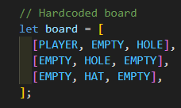
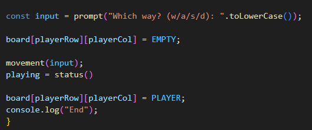
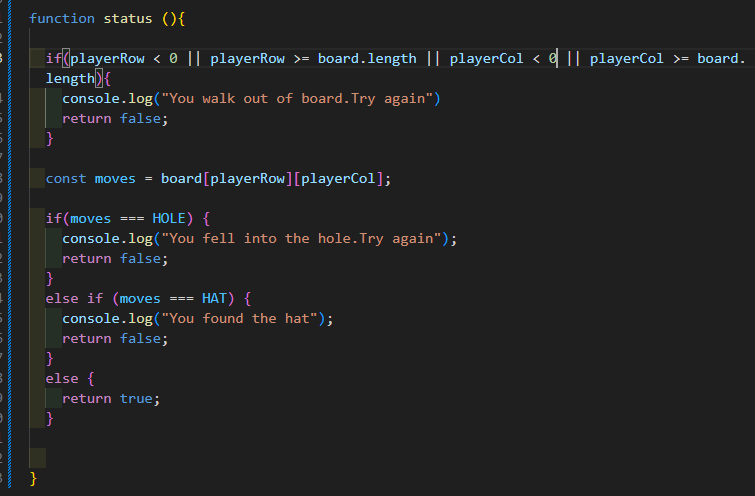
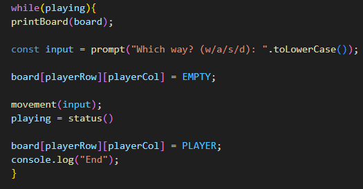

# Thinking Process Guidelines

## Table of Contents

- [Thinking Process Guidelines](#thinking-process-guidelines)
  - [Table of Contents](#table-of-contents)
  - [1. Workflow Planning](#1-workflow-planning)
  - [2.1. Board Functions (Hardcoded)](#21-board-functions-hardcoded)
  - [2.2. Board Functions (Generated)](#22-board-functions-generated)
  - [3. Input Functions](#3-input-functions)
  - [4. Movement Functions](#4-movement-functions)
  - [5. Game Rule Functions](#5-game-rule-functions)
  - [6. Game Play Loop](#6-game-play-loop)
- [WRITE YOUR THINKING PROCESS BELOW. ](#write-your-thinking-process-below)

## 1. Workflow Planning

↳ Draw a flowchart or write steps describing:

Game start
→
Read input
→
Update position
→
Check rules
→
End/Continue

↳ Must include:

- Input/output of each function.
- Edge cases (invalid input, boundaries, hole/hat tiles).

## 2.1. Board Functions (Hardcoded)

↳ Prints the hardcoded board in terminal.

Thinking process should explain:

- How the board is represented (2D array).
- Tile types (PLAYER, EMPTY, HOLE, HAT).

## 2.2. Board Functions (Generated)

↳ Creates a random board with player, hat, and holes.
↳ Prints the board in terminal.

Thinking process should explain:

- How the board is represented (2D array).
- Tile types (PLAYER, EMPTY, HOLE, HAT).
- How random placement avoids overlaps.

## 3. Input Functions

↳ Reads and validates user input (w, a, s, d).
↳ Logs invalid input.

Thinking process should explain:

- Input/output.
- Edge cases (invalid input, boundaries).
- How player position is updated.

## 4. Movement Functions

↳ Updates playerRow / playerCol based on the move.

Thinking process should explain:

- Input/output.
- Edge cases (invalid input, boundaries).
- How player position is updated.

## 5. Game Rule Functions

↳ Checks for out-of-bounds, falling into a hole, or finding the hat.

&nbsp;Game Rules:&nbsp;

- Wins by finding the hat.
- Loses by landing in a hole.
- Loses by moving outside the board.

Thinking process should explain:

- How to determine win/loss conditions.
- Handling messages for win/loss conditions.

## 6. Game Play Loop

↳ Combine all functions into a playable loop.
↳ Ensure messages appear correctly, board prints at start, and invalid input is handled.

Thinking process should explain:

- How to determine win/loss conditions.
- Handling messages for win/loss conditions
- How to update the board when the player moves.

---

# 
WRITE YOUR THINKING PROCESS BELOW.&nbsp;

<!-- Thinking Process -->
<!-- 1. Workflow Planning -->
-> เริ่มเกมขึ้นมา -> ตัว prompt จะรอรับค่าจากที่กดเล่น -> input จะรับค่านั้นมาละส่งไปให้ movement -> ถ้าตรงตามเงื่อนไขก็จะขยับ -> เมื่อขยับออกนอกบอร์ด หรือ ตกหลุม หรือ เจอหมวก -> status ก็จะทำการตรวจสอบ -> ส่งค่าตามทีกำหนดใน console.log

<!-- 2.1. Board Functions (Hardcoded) -->

เป็น Arr ที่มีค่าคงที่ โดยกำหนดให้ 
PLAYER = "*" เป็นตัวผู้เล่น
EMPTY = "░" คือพื้นที่
HOLE = "O" คือหลุม
HAT = "^" คือหมวก

<!-- 2.2. Board Functions (Generated) -->

<!-- 3. Input Functions -->

ให้ promt ส่งข้อมูลจากการกด w a s d ไปให้ input และใช้ .toLowerCase กำหนดค่าที่รับมาเป็นตัวเล็กทั้งหมด จากนั้น input จะเข้าไปทำงานใน movement ถ้าตรงเงื่อนไขก็จะเคลื่อนที่

<!-- 4. Movement Functions -->

ใน movement กำหนดค่าและเงื่อนไขของตัวนั้นๆให้เป็น true โดย 
w = ขึ้นข้างบน
a = ไปทางซ้าย
s = ลงข้างล่าง
d = ไปทางขวา
และถ้าไม่ตรงเงื่อนไขนี้ให้เป้น false

<!-- 5. Game Rule Functions -->

สร้างฟังก์ชัน status ขึ้นมา โดยตั้งเงื่อนไขให้ ถ้า row col < 0 หรือ row col มีตำแหน่งเดินมากกว่าจำนวน index ในบอร์ด ให้ถือว่าออกนอกบอร์ด

และสร้างตัวแปร moves ขึ้นมาเพื่อเก็บค่าตำแหน่งการเดิน และสร้างลูปโดยให้เงื่อนไข ถ้าเดินไปตรงกับ HOLE ให้ false และแสดงข้อความ "You fell into the hole.Try again" และหยุดลูป ถ้าเดินไปตรงกับ HAT ให้ false แสดงว่า "You found the hat" และหยุดลูป แต่ถ้าไม่ตรงกับ 2 เงื่อนไขนี้และยังอยู่ในบอร์ดให้เป็น true และเดินต่อได้

<!-- 6. Game Play Loop -->

ใช้ while loop เพราะไม่รู้จำนวนที่จะต้องวนลูป input รับค่ามา ส่งให้กับ movement จากนั้นตรวจดูเงื่อนไข หาก true ให้เดิน จากนั้น status จะตรวจสอบพื้นที่ที่เดินหากไม่ตรงกับตำแหน่งที่เป้น false ก็จะเดินต่อได้
แต่ถ้า movement = false ให้หยุด ให้บอร์ด = EMPTY เพื่อให้จุดยืนเดินเป็นค่าว่างเพื่อที่จะได้ไม่มีตัวผู้เล่นค้างที่ตำแหน่งเดิม และให้ บอร์ด = PLAYER เพื่อให้ตำแหน่งใหม่เป็นตัวผู้เล่น

[Back to Table of Contents](#table-of-contents)

---
